<div align="center">

# 天然卫星精密天体测量软件

### Natural Satellite Precision Astrometry Software · NSPA

**面向天然卫星观测的图像处理、天体测量与残差分析软件**


[项目简介](#项目简介) · [总体流程](#总体流程) · [处理效果](#处理效果) · [O-C 结果](#o-c-结果) · [安装](#安装) · [快速开始](#快速开始) · [技术文档](nspa/README.md)

</div>

---

## 项目简介

NSPA 用于天然卫星 CCD 观测数据的天体测量归算，包含图像预处理、星象检测与定心、参考星匹配、底片常数求解和 O-C 残差分析。
软件采用 GAIA DR3 恒星作为位置参考，以 IMCCE 历表提供的卫星理论位置进行目标识别和残差计算，输出实测赤经赤纬、DS9 区域文件及统计图表。
观测数据按夜组织，支持多帧处理与跨日汇总。

- **命令行**：`python -m nspa.main`，一次跑完全部步骤，或用 `--step` 单独运行某一步。
- **桌面界面**：`python ui/app.py`，选择数据与参数后调用同一个命令行入口。
- **运行记录**：每次运行写出 `outputs/runs/<run_id>/manifest.json`，记录各步耗时、告警与失败项。

## 总体流程

<p align="center">
  <a href="docs/assets/nspa-flow-overview.svg">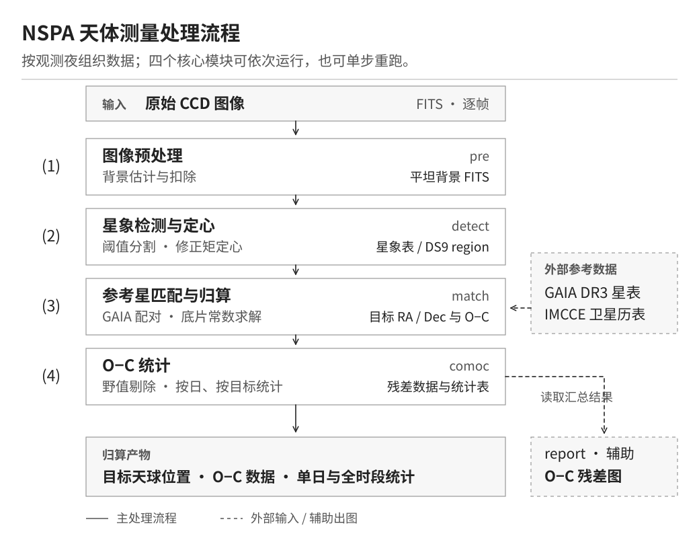</a>
</p>

四个核心模块各自读写文件，可以整条运行，也可以只重跑其中一步。
图中实线箭头表示主处理顺序，虚线箭头表示外部参考数据或辅助出图；四种颜色对应下方四个模块。
`report` 不参与计算，只把 ④ 的汇总结果画成残差图。

## 处理效果

下面四节各配一张模块流程图，再用**同一帧真实观测**展示该模块做了什么：

> **样本**：土卫九 S9（Phoebe），2024-11-03，帧 `20241103S9001I`，I 波段，曝光 45 s，2048×2048 像素（0.209″/px）。
> 图中的原始 FITS、预处理 FITS、检测 `.reg`、参考星 `.ref.reg`、`object_1.out` 都是这次观测的**归档产物**，
> 本页没有重跑 pre / detect。归档的预处理图是 float32，而当前代码的中值背景分支写出 uint16，
> 所以它不是当前版本刚生成的文件；配置按 `inputs/configs/nspa2024.cfg` 解读，但它与归档运行是否完全一致无法确认。
> 原始 FITS 不入库；每张图的来源、灰度范围和计数见 [`provenance.json`](docs/assets/provenance.json)。

**坐标约定**：所有像素坐标均为 DS9 physical（1-based），即 FITS 数组第 *j* 行第 *i* 列（从 0 数）的像素中心在
(*x*, *y*) = (*i*+1, *j*+1)。这两个文件头里没有 LTV1/LTV2，因此 physical 坐标与 image 坐标相同。
24 个检测圈的圈心与预处理图上局部光心相差的中位数约 0.13 px，说明图与 region 是对齐的。

### ① 图像预处理

<p align="center">
  <a href="docs/assets/nspa-flow-pre.svg">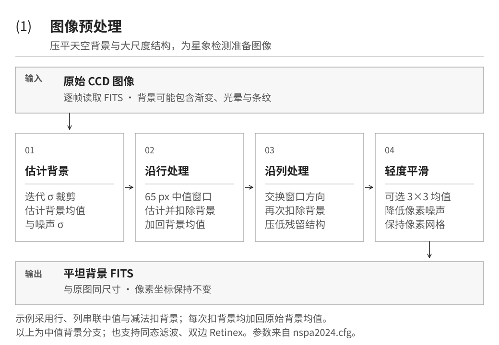</a>
</p>

这一帧的原始图像上有一个直径约 1000 px 的环形暗区和亮晕，亮晕与暗区的背景相差约 25 ADU。
预处理后，大尺度结构基本被扣除，背景中值保持在 687 ADU 左右。**两幅图使用完全相同的线性灰度 670–715 ADU。**

<p align="center">
  <a href="docs/assets/nspa-pre-fullframe.png">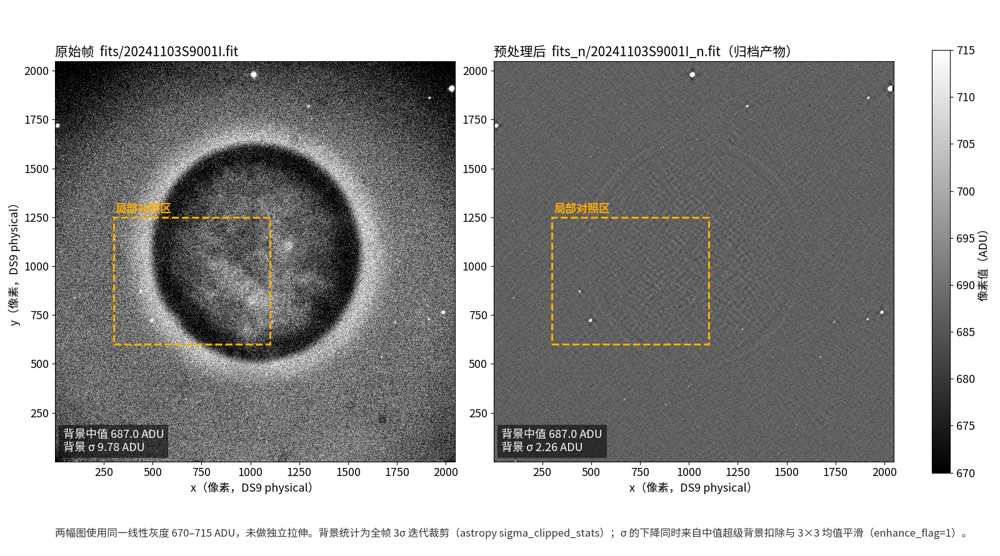</a>
</p>

局部放大（橙框，经过 S9 所在的暗区边缘）与剖面：原始帧沿 *y* = 871 从亮晕进入暗区，背景下降约 25 ADU；
预处理后这条剖面是平的，S9 的峰仍然清楚。右下图是全帧逐行、逐列的背景中值。

<p align="center">
  <a href="docs/assets/nspa-pre-zoom.png">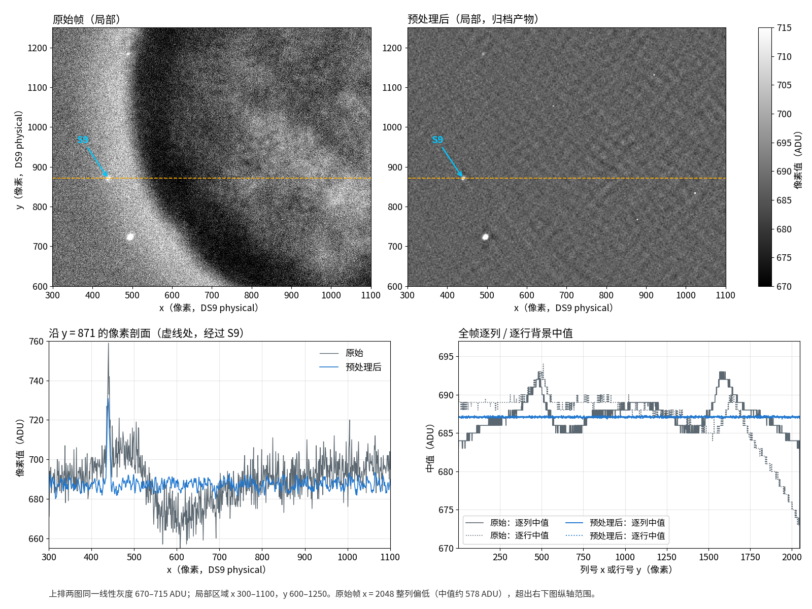</a>
</p>

全帧背景 σ 从 9.78 ADU 降到 2.26 ADU（3σ 迭代裁剪统计）。这个降幅同时来自背景扣除和 3×3 平滑，不能全部算作扣背景的效果。
预处理图上还能看到弱的斜向纹理，它会被带入下一步。

### ② 星象检测与定心

<p align="center">
  <a href="docs/assets/nspa-flow-detect.svg">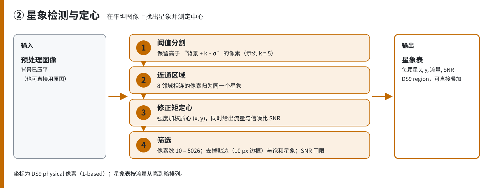</a>
</p>

检测结果是一个 DS9 region 文件。下图把归档 `.reg` 的 **24 个绿圈**按原坐标画回原始帧，编号即文件行序（从亮到暗）。
检测本身在预处理图上完成；两幅图像素网格相同，所以圈可以直接叠在原图上。

<p align="center">
  <a href="docs/assets/nspa-detect-overlay.png">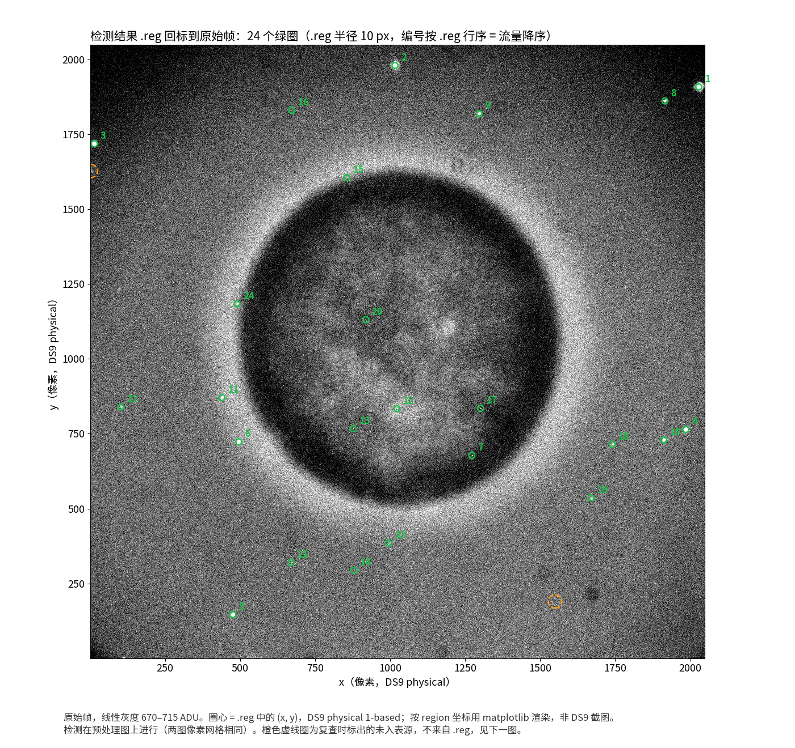</a>
</p>

上排是原始帧，下排是预处理图，12 格共用同一灰度。前四列是入表星象，从最亮的 #1（SNR 526）到表中最暗的 #24（SNR 3.1）；
后两列是按同一阈值复查时找到、但**没有**写入 `.reg` 的两个源，用来说明筛选规则如何工作：
一个是单像素热点（3×3 平滑后只占 9 px，少于最少像素数 10），一个是落在 10 px 边框内的贴边源。

<p align="center">
  <a href="docs/assets/nspa-detect-zoom.png">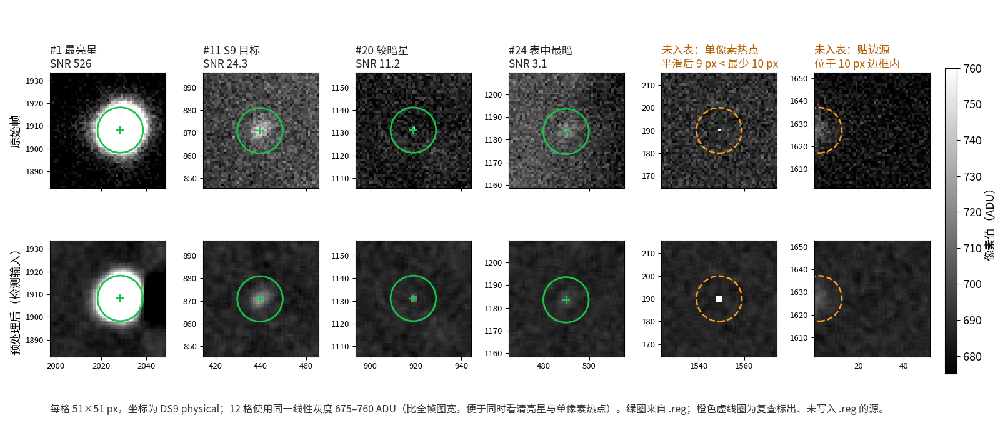</a>
</p>

这类叠图用来核对漏检和伪检，不能拿来验证定位精度。以上图件都是按 region 坐标用 matplotlib 渲染的，不是 DS9 截图。
要在 DS9 中亲自检查（需自备原始 FITS）：

```bash
ds9 fits/20241103S9001I.fit -zscale \
    -regions load fits_reg/20241103S9001I.fit.reg \
    -regions load fits_ref/20241103S9001I.fit1.ref.reg
```

两个 region 文件都声明了 `physical` 坐标系，DS9 会按 1-based 像素加载：绿圈为检测星，红圈为参考星。

### ③ 参考星匹配与底片归算

<p align="center">
  <a href="docs/assets/nspa-flow-match.svg">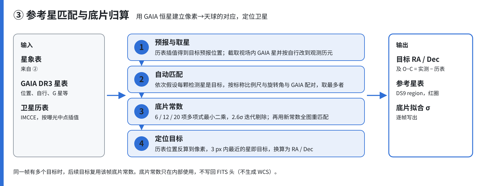</a>
</p>

归档 `.ref.reg` 记录了 **15 颗参考星**（红圈，R1–R15 为文件行序），它们都是检测星中与 GAIA 恒星对上的那部分。
S9 就是第 11 颗检测星。其余 8 个检测源在所附 GAIA 星表中 30″ 内没有任何对应，可能是星表未收录的暗源、宇宙线或热点，它们不参与底片拟合。
右图放大 S9：由历表位置反算回来的像素点与实测质心相差约 0.2 px。

<p align="center">
  <a href="docs/assets/nspa-match-overlay.png">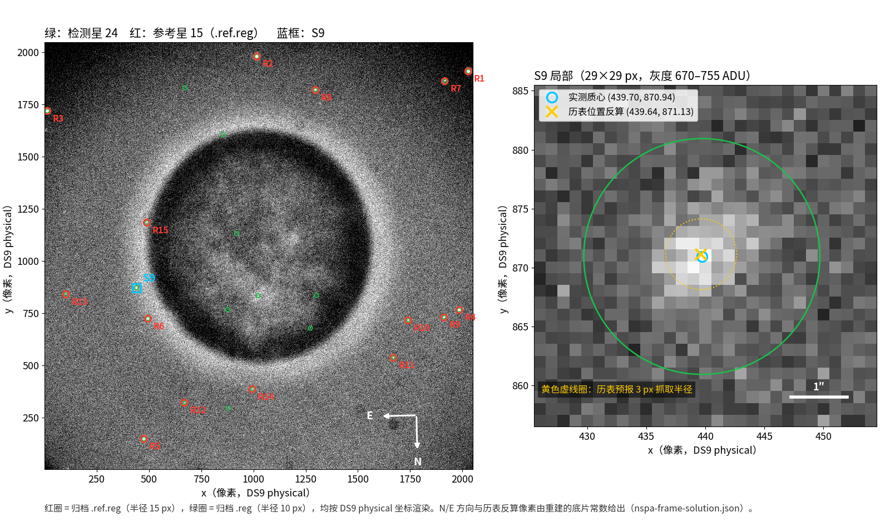</a>
</p>

同一批参考星画在天球上：左图是 RA/Dec 分布（东在左），视场四角由底片常数换算得到；
右上是 15 颗参考星的底片拟合残差，其中 R15 超出 2.6σ，在迭代中被剔除，实际参与拟合的是 14 颗；
右下是本帧 S9 的实测位置相对历表位置的偏移。

<p align="center">
  <a href="docs/assets/nspa-match-sky.png">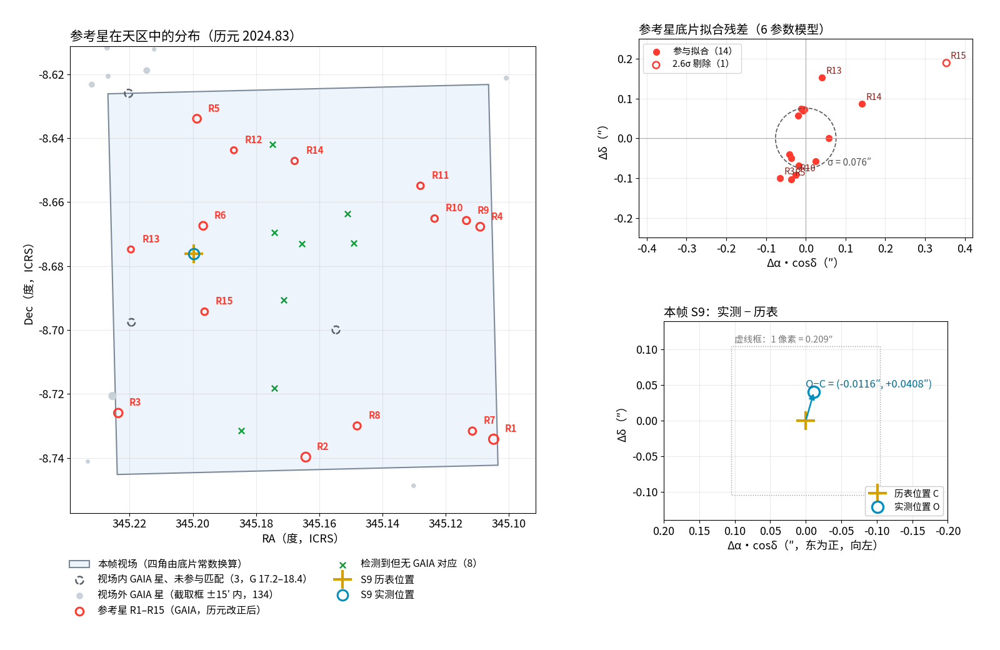</a>
</p>

本帧结果：6 参数底片模型，拟合 σ = 0.076″；S9 的 O-C = (−0.012″, +0.041″)。

<details>
<summary>这些天球坐标是怎么得到的</summary>

- 程序不输出 WCS。图中的底片常数、视场四角和历表反算像素，是用仓库自己的匹配函数重建出来的：
  [`reconstruct_frame.py`](docs/assets/src/reconstruct_frame.py) 读取归档检测 `.reg`、FITS 头中的曝光时刻、
  `nspa2024.cfg`、GAIA 星表和历表，按 `match` 步骤对第一个目标的同样流程运行一次。
- 与归档产物逐项核对：15 颗参考星的像素坐标与 `.ref.reg` 完全一致；目标实测 RA/Dec、历表位置与 `object_1.out` 的差 ≤ 0.0001″（即文件的舍入位）；
  底片 σ 同为 0.0761″。结果写在 [`nspa-frame-solution.json`](docs/assets/nspa-frame-solution.json)。
- `.ref.reg` 里的 Dec 只保留 3 位小数（约 3.6″），不能直接用于精密计算。天区图用 8 位小数的 RA 加粗 Dec，
  在已改正到观测历元的 GAIA 星中逐颗查找对应，15 颗均唯一，并与重建结果中的完整坐标一致。
- 视场内 18 颗 G ≤ 18.5 的 GAIA 星中，有 15 颗成为参考星，另外 3 颗（G 17.2–18.4）未被检测到。

</details>

### ④ O-C 统计

<p align="center">
  <a href="docs/assets/nspa-flow-comoc.svg">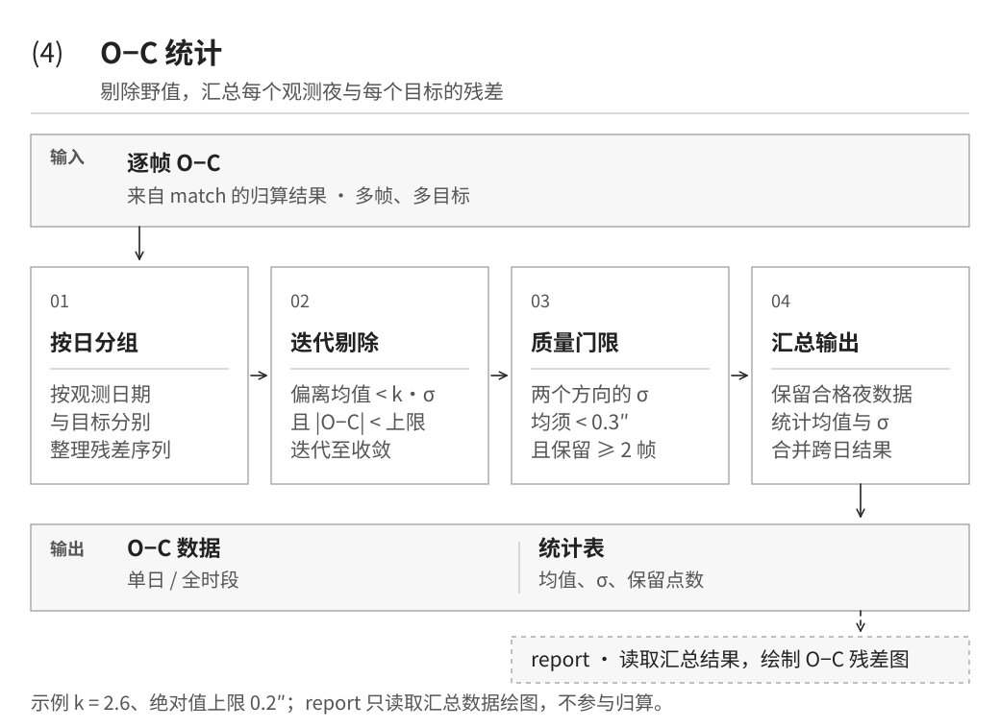</a>
</p>

## O-C 结果

**S9，2024-11-03**：本页示例帧所在的整晚，comoc 保留了 11 帧，示例帧 001 已圈出。

<p align="center">
  <a href="docs/assets/nspa-oc-s9-2024.png">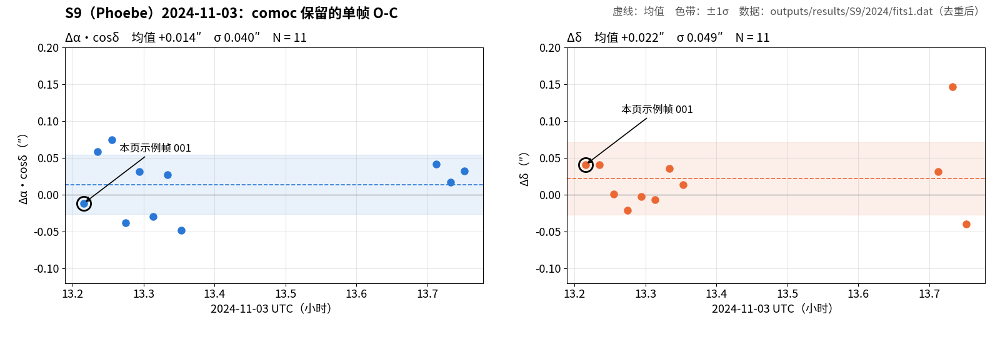</a>
</p>

**U/2020 汇总**：天王星五颗卫星 U1–U5，2020 年 11 月 6 个观测夜。下图是 `report` 模块直接输出的
[`OC_summary.png`](outputs/results/U/2020/OC_summary.png)。

<p align="center">
  <a href="outputs/results/U/2020/OC_summary.png">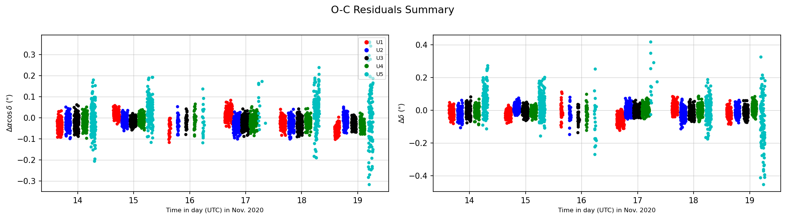</a>
</p>

| 数据集 | 目标 | 保留点数 | σ(Δα·cosδ) | σ(Δδ) |
|---|---|---:|---:|---:|
| S9/2024 | S9 | 11 | 0.040″ | 0.049″ |
| U/2020 | U1 | 950 | 0.037″ | 0.034″ |
| U/2020 | U2 | 959 | 0.025″ | 0.030″ |
| U/2020 | U3 | 960 | 0.023″ | 0.026″ |
| U/2020 | U4 | 960 | 0.024″ | 0.027″ |
| U/2020 | U5 | 661 | 0.085″ | 0.104″ |

表中数值是**剔除野值后**的内部离散度，反映残差相对历表的分布，不等于绝对精度；它们还受观测条件、目标亮度、参数和历表误差影响，
不同数据集之间不宜直接比较。归档的 `S9/2024/fits1.dat` 中每帧各出现两次（22 行），上表与上图已去重，按 11 帧计。

## 安装

需要 **Python ≥ 3.10**。

```bash
git clone https://github.com/mieyu/natural-satellite-astrometry.git
cd natural-satellite-astrometry
python -m venv .venv && source .venv/bin/activate   # 可选
pip install -r requirements.txt
```

依赖：`numpy`、`scipy`、`astropy`、`opencv-python`、`matplotlib`、`bottleneck`、`numba`。
桌面界面还需要 Tkinter（部分 Linux 发行版需另装 `python3-tk`）。

## 数据准备

仓库**不包含原始观测 FITS**。运行前准备三类数据：

| 数据 | 放置位置 | 说明 |
|---|---|---|
| 原始观测图像 | `inputs/images/<目标>/<观测期>/<YYYYMMDD>/fits/*.fit` | 支持的望远镜头格式：`ss156`、`ss156_2014`、`km100`、`km100B`、`lj240` |
| GAIA 参考星表 | `inputs/catalogs/<目标>/<观测期>/GAIA3_*.DAT` | VizieR 文本导出：RA、Dec（度）、pmRA、pmDE（mas/yr）、G 星等 |
| 目标历表 | `inputs/catalogs/<目标>/<观测期>/EPH_*.DAT` | IMCCE 格式：年 月 日 时 分 秒 RA(h) Dec(°) |

仓库已附 U（2020）、J（2023）、S9（2024/2025）的星表与历表样例。`1fitspath` 可以指向单个 `fits` 目录，
也可以指向包含多个 `YYYYMMDD/fits` 的上级目录。

## 快速开始

请**在仓库根目录**运行，并**显式传入 `--config`**（cfg 中的相对路径以当前目录为起点；
代码里的默认配置文件不在仓库中）。已跟踪的配置中，[`nspa2024.cfg`](inputs/configs/nspa2024.cfg) 使用仓库内相对路径，
其余 cfg 含原作者本机的绝对路径，使用前需修改。

```bash
# 先把 S9 2024 年 11 月的观测图放到 inputs/images/S9/2024/202411/<YYYYMMDD>/fits/
python -m nspa.main --config inputs/configs/nspa2024.cfg              # 全部步骤
python -m nspa.main --config inputs/configs/nspa2024.cfg --step pre   # 单步：pre / detect / match / comoc / report
```

桌面界面：`python ui/app.py`，详见 [ui/README.md](ui/README.md)。作为库调用：

```python
from nspa.application.context import build_context
from nspa.application.pipeline import PipelineRunner
from nspa.application.steps import select_steps, selected_step_names
from nspa.config import load_config

steps = selected_step_names("all")
config = load_config("inputs/configs/nspa2024.cfg", steps=steps)
PipelineRunner(select_steps("all")).run(build_context(config, steps))
```

### 常用参数

cfg 为 `key=value` 格式，数字前缀表示所属步骤。完整说明见 [nspa/README.md](nspa/README.md)。

| 参数 | 示例（nspa2024.cfg） | 含义 |
|---|---|---|
| `1superflag` | `1` | 0 跳过；1 中值超级背景；2 同态滤波；3 双边 Retinex |
| `1med_length` / `1med_width` | `65` / `1` | 中值窗口；其一为 1 时按“行 → 列”串联 |
| `2bkgd_threshold` | `5.0` | 检测阈值 = 背景 + k·σ |
| `2pos_method` | `1` | 修正矩阶数（1/2/3） |
| `3tele_label` / `3tele_focal` / `3ccd_scale` | `km100B` / `13300.0` / `0.0135` | 望远镜头格式、焦距 (mm)、像元尺寸 (mm) |
| `3modeltype` | `6` | 底片常数项数（6/12/20） |
| `3match_limit` | `5.0` | 匹配距离阈值（角秒） |
| `4std_limit` / `4eps` | `2.6` / `0.2` | 野值剔除 σ 倍数 / O-C 绝对值上限（角秒） |
| `4specified-output` | `outputs/results/S9/2024` | 汇总与图件输出目录 |

### 输出

```text
<YYYYMMDD>/
├── fits/        # 原始图像（输入，不修改）
├── fits_n/      # ① 预处理图像 *_n.fit
├── fits_reg/    # ② 检测星 *.fit.reg（绿圈）
├── fits_ref/    # ③ 参考星 *.ref.reg（红圈）
└── fits_out/    # ③④ object_N.out、final_object_N.out、final_oc_N.out

<4specified-output>/   # ④ 与 report：*N.dat、00oc_N.out、*_all_*.out、*_obsdata_*.out、OC_*.png
outputs/runs/<run_id>/manifest.json
```

## 技术边界

- 背景处理只有上文的超级背景 / 同态滤波 / 双边 Retinex；cfg 中的 bias、dark、flat 开关目前不生效。
- 定心只有修正矩，没有 PSF 拟合。
- 底片常数只在内部使用，不写回 FITS 头，不生成 WCS；没有独立的几何畸变模型，12/20 项底片常数可吸收部分高阶项。
- 历表读取只支持 IMCCE 格式。

## 仓库结构

```text
natural-satellite-astrometry/
├── nspa/                  # 核心包：命令行入口、配置、流程编排、算法、文件读写
├── ui/                    # Tkinter 桌面界面
├── inputs/                # configs/、catalogs/（images/ 需自备）
├── outputs/results/       # 归档的天然卫星归算结果
├── docs/assets/           # README 图件、provenance.json 与生成脚本（src/）
└── requirements.txt
```

README 图件均可复现：`docs/assets/src/make_flow_diagrams.py` 生成流程图；
`reconstruct_frame.py` 与 `make_frame_figures.py` 在给定归档目录（`--materials <含 inputs/images/... 的目录>`）时生成单帧证据图与 O-C 图。

重新生成全部五张流程图（仅需 Python 标准库）：

```bash
python docs/assets/src/make_flow_diagrams.py
```

## 文档

- [nspa/README.md](nspa/README.md)：处理流程、cfg 全部参数、产物约定、库调用方式
- [ui/README.md](ui/README.md)：桌面界面使用说明
