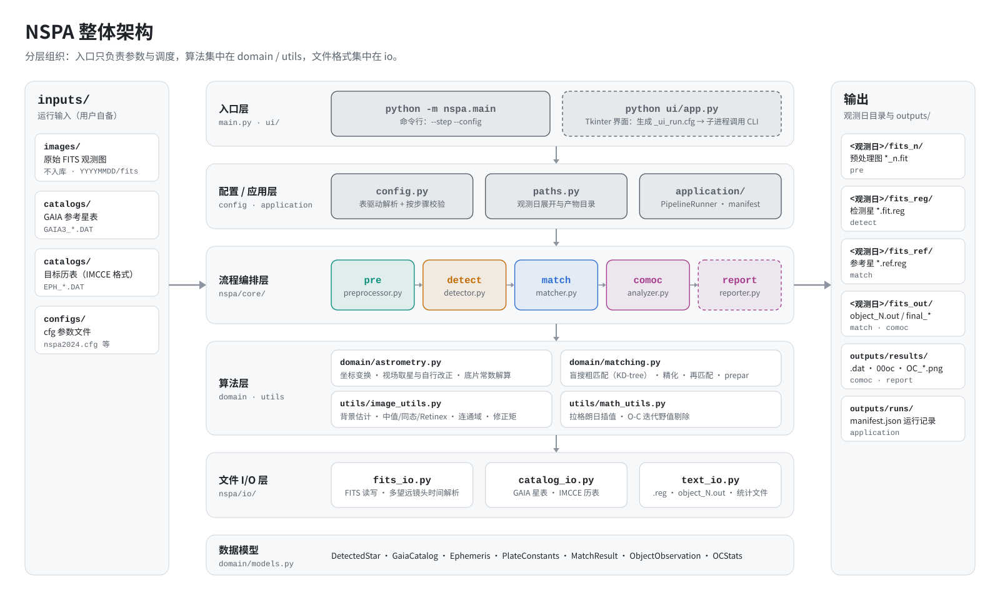
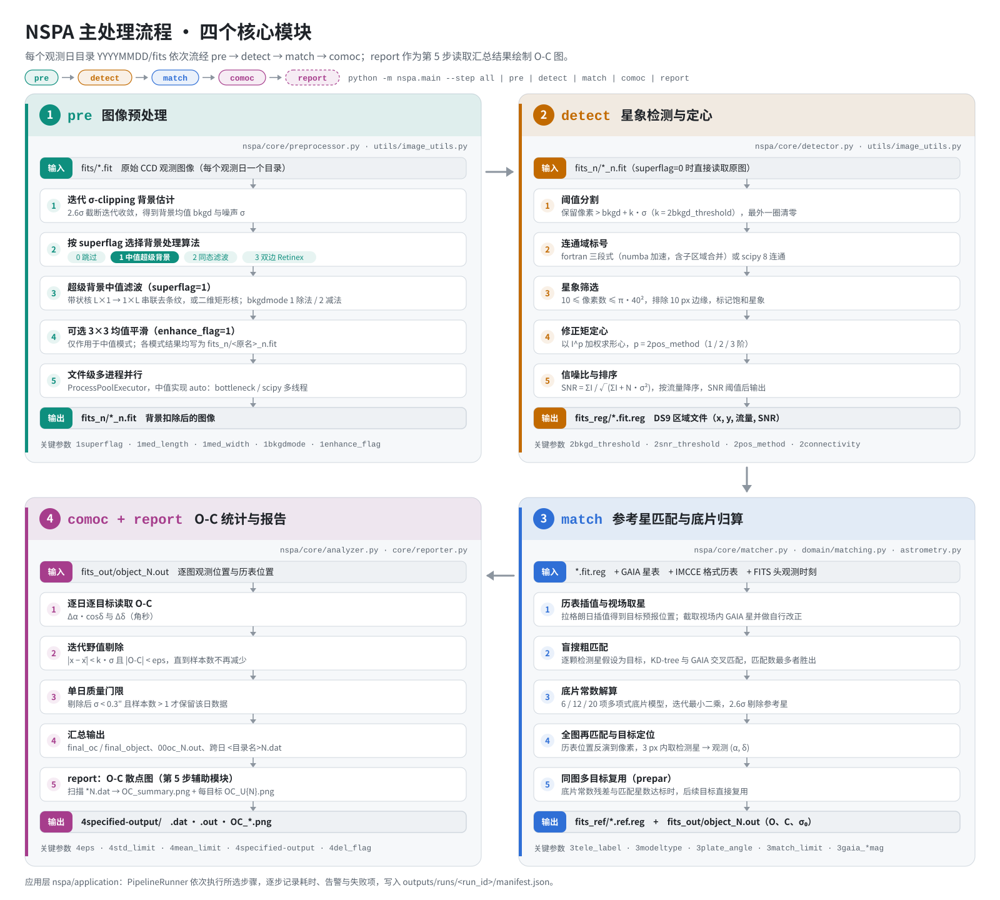
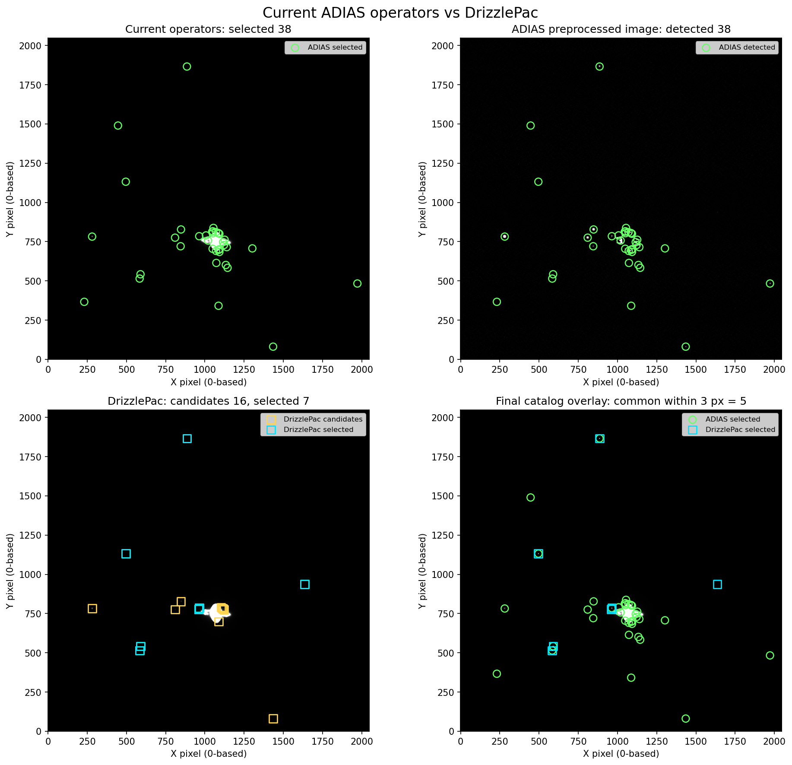
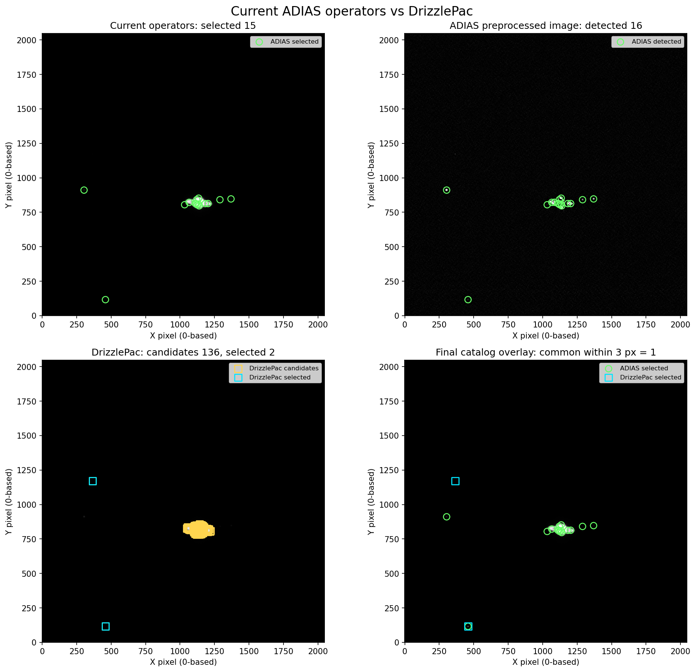
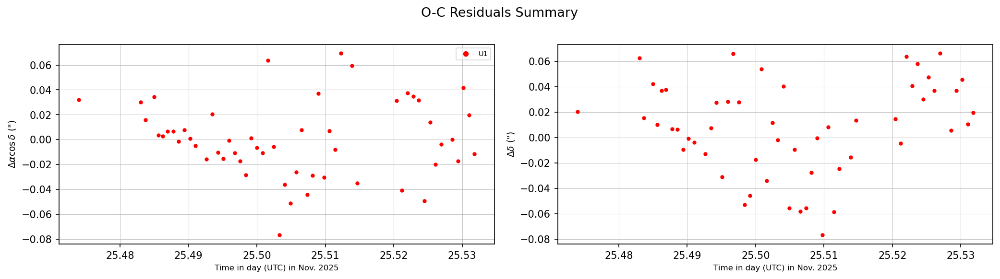
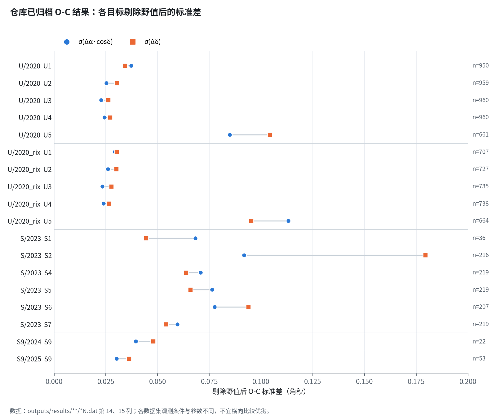

<div align="center">

# NSPA · 天然卫星精密天体测量软件

**Natural Satellite Precision Astrometry Software**


面向天然卫星 CCD 观测的天体测量数据处理流水线：<br>
从原始 FITS 图像到目标天球位置、O-C 残差统计与残差图。

[处理流程](#主处理流程四个核心模块) · [安装](#安装) · [快速开始](#快速开始) · [结果展示](#结果展示) · [技术文档](nspa/README.md)

</div>

---

## 简介

NSPA 是用 Python 编写的天然卫星 CCD 天体测量流水线。它以观测日目录 `YYYYMMDD/fits` 为处理单元，
依次完成**背景预处理 → 星象检测与定心 → GAIA 参考星匹配与底片常数归算 → O-C 野值剔除与统计**，
最后由报告模块绘制 O-C 残差图。目标的理论位置来自 IMCCE 格式历表，参考星来自 GAIA 星表
（位置按星表自行改正到观测历元）。

- **命令行**：`python -m nspa.main`，可运行全部 5 步，也可用 `--step` 单独运行某一步。
- **桌面界面**：`python ui/app.py`（Tkinter），根据选择生成 cfg，再以子进程调用同一个命令行入口。
- **运行记录**：每次运行写出 `outputs/runs/<run_id>/manifest.json`，包含步骤耗时、告警和失败项。

### 已实现功能

| 模块 | 已实现 |
|---|---|
| `pre` 图像预处理 | 迭代 σ-clipping 背景估计；超级背景中值滤波（带状核串联去条纹 / 矩形核，除法或减法扣背景）；同态滤波；双边 Retinex；可选 3×3 均值平滑；文件级多进程并行 |
| `detect` 星象检测 | 阈值分割；Fortran 兼容三段式连通域标号（numba 加速）或 scipy 8 连通；像素数、边缘和饱和筛选；1/2/3 阶修正矩定心；SNR 计算与筛选；输出 DS9 region |
| `match` 匹配归算 | 历表拉格朗日插值；视场内 GAIA 取星与自行改正；以检测星逐一假设目标的盲搜粗匹配（KD-tree 快路径，必要时回退暴力搜索）；6/12/20 项多项式底片常数加权迭代最小二乘；全图再匹配；按历表预报在 3 px 内定位目标；同图多目标复用底片常数 |
| `comoc` O-C 统计 | 逐日逐目标 k·σ 迭代野值剔除（或均值偏差模式）；单日质量门限；输出单日、全时段汇总文件 |
| `report` 报告 | 读取 comoc 汇总 `.dat`，绘制 `OC_summary.png` 和逐目标 `OC_U{N}.png` |

### 尚未实现 / 规划中

以下内容出现在早期产品描述或 cfg 注释中，**当前代码未实现**，这里列出以免误解：

- **bias / dark / flat 本底平场改正**：cfg 解析 `1biasflag`、`1darkflag`、`1flatflag`，但处理流程没有使用这些参数；
  当前的预处理只有上表中的背景滤波算法。
- **PSF 拟合定心**：定心方法只有修正矩（`2pos_method` 取 1/2/3）。
- **WCS 解算写回 FITS 头**：底片常数只在内部用于坐标换算，不写出 WCS 关键字。
- **独立的几何畸变改正**：没有单独的畸变模型。高阶底片常数（12/20 项）可以吸收视场内部分二次、三次项。
- **JPL 历表**：cfg 中有 `3obj_ephsource` 字段，但读取器只解析 IMCCE 格式的历表文件。
- **针对卫星相位或光照形态的自适应定心**：未实现。

## 整体架构

<p align="center">
  
</p>

| 层 | 目录 | 职责 |
|---|---|---|
| 入口 | `nspa/main.py`、`ui/` | 命令行参数；Tkinter 界面（生成 `_ui_run.cfg`，以子进程调用命令行） |
| 配置 / 应用 | `nspa/config.py`、`nspa/paths.py`、`nspa/application/` | 表驱动解析 cfg 并按步骤校验；展开观测日目录；`PipelineRunner` 调度与 manifest 记录 |
| 流程编排 | `nspa/core/` | `pre` / `detect` / `match` / `comoc` / `report` 五个步骤 |
| 算法 | `nspa/domain/`、`nspa/utils/` | 坐标变换、底片常数、匹配；背景、滤波、连通域、定心；插值与野值剔除 |
| 文件 I/O | `nspa/io/` | FITS 读写与多台望远镜的头文件时间解析；GAIA 星表、IMCCE 历表；`.reg` 与 `.out` 文件 |

## 主处理流程：四个核心模块

`python -m nspa.main --step all` 依次执行 5 个步骤。其中 `pre`、`detect`、`match`、`comoc` 是四个核心处理模块，
`report` 是第 5 个辅助模块，负责根据 comoc 结果绘图，所以下图把它放在第 4 个面板中一起展示。

<p align="center">
  
</p>

| 步骤 | 实现 | 输入 | 输出 |
|---|---|---|---|
| `pre` | `core/preprocessor.py` | `fits/*.fit` | `fits_n/*_n.fit` |
| `detect` | `core/detector.py` | `fits_n/*_n.fit`（`1superflag=0` 时读原图） | `fits_reg/*.fit.reg` |
| `match` | `core/matcher.py` | `*.fit.reg` + GAIA 星表 + IMCCE 历表 | `fits_ref/*.ref.reg`、`fits_out/object_N.out` |
| `comoc` | `core/analyzer.py` | `fits_out/object_N.out` | `fits_out/final_*`、`<输出目录>/*.out`、`<输出目录>/*N.dat` |
| `report` | `core/reporter.py` | `<输出目录>/*N.dat` | `<输出目录>/OC_summary.png`、`OC_U{N}.png` |

> PNG 版本：[`nspa-pipeline.png`](docs/assets/nspa-pipeline.png) · [`nspa-architecture.png`](docs/assets/nspa-architecture.png)。
> 两张图由 [`docs/assets/src/make_diagrams.py`](docs/assets/src/make_diagrams.py) 生成。

## 安装

需要 **Python ≥ 3.10**（代码使用了 `X | None` 类型注解和带括号的多上下文 `with` 语句）。

```bash
git clone https://github.com/mieyu/natural-satellite-astrometry.git
cd natural-satellite-astrometry
python -m venv .venv && source .venv/bin/activate   # 可选
pip install -r requirements.txt
```

依赖：`numpy`、`scipy`、`astropy`、`opencv-python`、`matplotlib`、`bottleneck`、`numba`。
桌面界面还需要 Python 自带的 Tkinter（部分 Linux 发行版需要单独安装 `python3-tk`）。

## 数据准备

仓库**不包含原始观测 FITS 图像**（已在 `.gitignore` 中排除）。运行前需要自备以下三类数据：

| 数据 | 放置位置 | 说明 |
|---|---|---|
| 原始观测图像 | `inputs/images/<目标>/<观测期>/<YYYYMMDD>/fits/*.fit` | 当前支持的望远镜头格式：`ss156`、`ss156_2014`、`km100`、`km100B`、`lj240`（`3tele_label`） |
| GAIA 参考星表 | `inputs/catalogs/<目标>/<观测期>/GAIA3_*.DAT` | 跳过前 60 行表头；每行跳过前 39 个字符后依次读取 RA(°)、Dec(°)、pmRA、pmDE(mas/yr)、G 星等 |
| 目标历表 | `inputs/catalogs/<目标>/<观测期>/EPH_*.DAT` | IMCCE 格式，跳过前 10 行；每行为 年 月 日 时 分 秒 RA(h) Dec(°) … |

仓库中已有 U（2020）、J（2023）、S9（2024/2025）的星表与历表样例，位于 `inputs/catalogs/`。

```text
inputs/
├── configs/                      # cfg 参数文件
├── catalogs/<目标>/<观测期>/       # GAIA3_*.DAT、EPH_*.DAT
└── images/<目标>/<观测期>/          # 用户自备，不入库
    └── <YYYYMMDD>/fits/*.fit
```

`1fitspath` 可以指向单个 `fits` 目录，也可以指向包含多个 `YYYYMMDD/fits` 的上级目录，程序会自动展开成每个观测日。

## 快速开始

必须**在仓库根目录**运行，因为 cfg 中的相对路径以当前目录为起点。

> **请显式传入 `--config`。** `nspa/main.py` 中的默认配置是 `inputs/configs/nspa2023S0.cfg`，这个文件不在仓库里。
> 已跟踪的配置中，只有 [`inputs/configs/nspa2024.cfg`](inputs/configs/nspa2024.cfg) 使用仓库内的相对路径。
> 其他 cfg（`nspa.cfg`、`nspa202011.cfg`、`nspa(1).cfg`）保留了原作者本机的绝对路径，使用前需要修改。

```bash
# 以 nspa2024.cfg 为例：先把 S9 2024 年 11 月的观测图放到 inputs/images/S9/2024/202411/<YYYYMMDD>/fits/
python -m nspa.main --config inputs/configs/nspa2024.cfg              # 运行全部 5 步

python -m nspa.main --config inputs/configs/nspa2024.cfg --step pre   # 单步：pre / detect / match / comoc / report
python -m nspa.main --config inputs/configs/nspa2024.cfg --step report
```

桌面界面：

```bash
python ui/app.py
```

在界面里选择“目标 / 观测期”，程序会自动匹配 `inputs/catalogs/` 中的星表和历表，调整参数后点击“运行”。
详见 [ui/README.md](ui/README.md)。

也可以作为库调用，这与命令行执行的是同一条流水线：

```python
from nspa.application.context import build_context
from nspa.application.pipeline import PipelineRunner
from nspa.application.steps import select_steps, selected_step_names
from nspa.config import load_config

steps = selected_step_names("all")
config = load_config("inputs/configs/nspa2024.cfg", steps=steps)
PipelineRunner(select_steps("all")).run(build_context(config, steps))
```

### 常用参数

cfg 使用 `key=value` 格式，数字前缀表示所属步骤。完整说明见 [nspa/README.md](nspa/README.md)。

| 参数 | 示例（nspa2024.cfg） | 含义 |
|---|---|---|
| `1superflag` | `1` | 0 跳过；1 中值超级背景；2 同态滤波；3 双边 Retinex |
| `1med_length` / `1med_width` | `65` / `1` | 中值核尺寸；其中一个为 1 时按“行 → 列”串联带状滤波 |
| `2bkgd_threshold` | `5.0` | 检测阈值 = bkgd + k·σ |
| `2pos_method` | `1` | 修正矩阶数（1/2/3） |
| `3tele_label` / `3tele_focal` / `3ccd_scale` | `km100B` / `13300.0` / `0.0135` | 望远镜头格式、焦距 (mm)、像元尺寸 (mm) |
| `3modeltype` | `6` | 底片常数项数（6/12/20） |
| `3match_limit` | `5.0` | 匹配距离阈值（角秒） |
| `4std_limit` / `4eps` | `2.6` / `0.2` | 野值剔除 σ 倍数 / O-C 绝对值上限（角秒） |
| `4specified-output` | `outputs/results/S9/2024` | 跨日汇总与图件输出目录 |

### 输出

```text
<YYYYMMDD>/
├── fits/        # 原始图像（输入，不修改）
├── fits_n/      # pre：*_n.fit
├── fits_reg/    # detect：*.fit.reg
├── fits_ref/    # match：*.ref.reg（参考星）
└── fits_out/    # match / comoc：object_N.out、final_object_N.out、final_oc_N.out

<4specified-output>/   # comoc / report：*N.dat、00oc_N.out、*_all_*.out、*_obsdata_*.out、OC_*.png
outputs/runs/<run_id>/manifest.json
```

## 结果展示

以下内容全部来自仓库中已提交的结果文件，没有为 README 重新运行处理流程。

### 1. 星象检测算子与 DrizzlePac 对照

> 图中的 **ADIAS** 是本项目更名为 NSPA 之前的实验名称，指 NSPA 的 `pre` + `detect` 算子。

实验在 2023-11 的两帧 2048×2048 观测图上分别调用 NSPA 的预处理/检测算子和 DrizzlePac 的检测/定心算子，
**没有运行完整的 NSPA 流水线**。完整数据见 [`outputs/operator_comparison/`](outputs/operator_comparison/)
和 [`outputs/drizzlepac_demo/`](outputs/drizzlepac_demo/)。

| 帧 | 方法 | 初始检测 | 最终输出 | 两边最终星表 3 px 内重合 | 共同星的质心差 |
|---|---|---:|---:|---:|---|
| `S0_20231114114611B` | NSPA（ADIAS）算子 | 38 | 38 | 5 | 0.050 – 0.286 px（5 颗） |
|  | DrizzlePac | 16 | 7 | | |
| `S0_20231115112358B` | NSPA（ADIAS）算子 | 16 | 15 | 1 | 0.040 px（1 颗） |
|  | DrizzlePac | 136 | 2 | | |

<table>
  <tr>
    <td width="50%"></td>
    <td width="50%"></td>
  </tr>
  <tr>
    <td align="center"><sub>S0_20231114114611B（绿圈：NSPA/ADIAS；方框：DrizzlePac）</sub></td>
    <td align="center"><sub>S0_20231115112358B</sub></td>
  </tr>
</table>

**比较条件与局限**

- 两种方法的参数不同：NSPA 算子使用 45×1 与 1×45 两次中值背景扣除、3×3 均值平滑、3.5σ 阈值、
  Fortran 连通域和一阶修正矩（参数来自 `adias2023S0.cfg`，该文件未提交到仓库）；DrizzlePac 使用 FWHM = 3.5 px 的高斯卷积、
  DAOFIND 风格的质心，以及 sharpness/roundness 筛选。
- **检测数量不代表精度。** 两种方法筛选目标的标准不同，数量多少不能说明哪种方法更准确，两帧的数量对比方向也正好相反。
- 质心差只基于 5 颗和 1 颗共同星，只能说明两种定心方法在这些星上结果接近，**不是**对真值的精度评估。
- 预处理后背景 σ 从 8.47 降到 1.51 ADU（第 1 帧），从 3.62 降到 1.04 ADU（第 2 帧）。这个降幅主要来自中值扣背景和 3×3 平滑，
  不等同于定位精度的提升。
- 生成这组对照结果的脚本不在仓库中。

### 2. O-C 残差结果

`comoc` 只保留野值剔除后、单日标准差小于 0.3″ 的观测，`report` 再把这些结果画成残差图。
下面是 `U/2020` 数据集（U1–U5 五个目标，2020 年 11 月，6 个 UTC 观测日）的 O-C 汇总图：

<p align="center">
  
</p>

单目标、单夜的结果（S9，2025 年 11 月，53 个观测点；图例中的 “U1” 是 report 模块固定使用的目标编号前缀）：

<p align="center">
  
</p>

下图根据仓库中全部非空的 `outputs/results/**/*N.dat` 计算各目标 O-C 的标准差
（数值表：[`nspa-oc-stats.csv`](docs/assets/nspa-oc-stats.csv)，
脚本：[`plot_oc_dispersion.py`](docs/assets/src/plot_oc_dispersion.py)）：

<p align="center">
  
</p>

| 数据集 | 目标 | 观测点数 | σ(Δα·cosδ) | σ(Δδ) |
|---|---|---:|---:|---:|
| U/2020 | U1–U4 | 950–960 / 目标 | 0.023″ – 0.037″ | 0.026″ – 0.034″ |
| U/2020 | U5 | 661 | 0.085″ | 0.104″ |
| S/2023 | S1、S2、S4–S7 | 36–219 / 目标 | 0.060″ – 0.092″ | 0.044″ – 0.179″ |
| S9/2024 | S9 | 22 | 0.039″ | 0.048″ |
| S9/2025 | S9 | 53 | 0.030″ | 0.036″ |

**解读注意事项**

- 这些数值是**剔除野值后**的内部离散度，反映的是相对于历表的残差分布，不是绝对精度；它们同时受观测条件、
  目标亮度、参数设置和历表误差影响。
- 各数据集的观测设备、日期、cfg 参数都不同，**不宜横向比较**哪一组更好。
  `U/2020` 与 `U/2020_rix` 是同一观测期的两套归档结果；缺少与各次运行一一对应的配置记录，
  因此不能仅凭目录名将两者差异归因于某种预处理方法或参数。
- `S/2006`、`S/2014` 的 `.dat` 以及 `S/2023` 的 S3、S8 为空文件，没有有效结果。
- `S/2023` 的 `OC_S*.png` 图例使用 S 前缀，而当前 `report` 固定使用 U 前缀并最多支持 5 个目标，
  因此这组归档图与当前已提交的报告代码不一致；具体生成版本尚未确认。

## 仓库结构

```text
natural-satellite-astrometry/
├── nspa/                  # 核心包
│   ├── main.py            # 命令行入口
│   ├── config.py          # cfg 解析与校验
│   ├── paths.py           # 观测日展开与产物目录
│   ├── application/       # PipelineRunner、上下文、日志、manifest
│   ├── core/              # pre / detect / match / comoc / report
│   ├── domain/            # 天体测量与匹配算法、数据模型
│   ├── io/                # FITS、星表/历表、文本产物读写
│   ├── utils/             # 图像处理与数学工具
│   └── README.md          # 详细技术文档
├── ui/                    # Tkinter 桌面界面
├── inputs/                # configs/、catalogs/（images/ 需自备）
├── outputs/               # results/、operator_comparison/、drizzlepac_demo/
├── docs/assets/           # README 图件及其生成脚本
└── requirements.txt
```

## 文档

- [nspa/README.md](nspa/README.md)：处理流程、cfg 全部参数、产物约定、库调用方式
- [ui/README.md](ui/README.md)：桌面界面使用说明
- [nspa/docs/figures/match_pipeline.svg](nspa/docs/figures/match_pipeline.svg)：match 模块示意图
